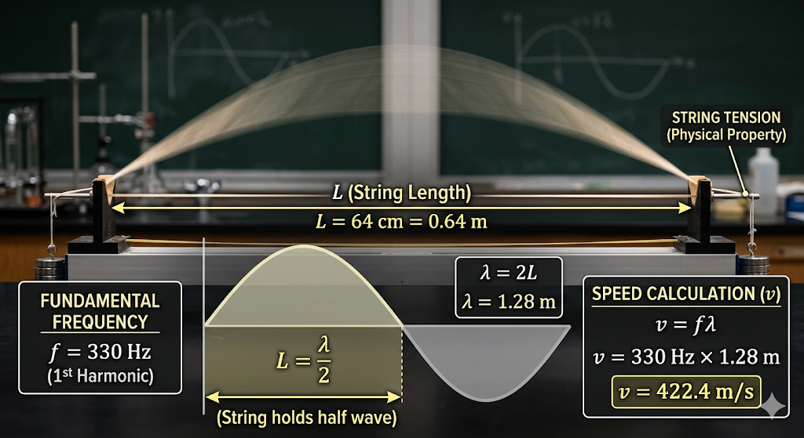

## 2. String Harmonics: The Fundamental Frequency

When a string is tied down at both ends (like on a guitar or piano) and plucked, it vibrates. The simplest, lowest-pitched vibration it can make is called the **fundamental frequency** or the first harmonic ($n=1$). 

In this state, the entire string bows up and down as a single large arc. Because a full wave consists of an "up" arc and a "down" arc, this single arc represents exactly **half of a full wavelength**.

### Step 1: The Length-Wavelength Relationship
Because the string only holds half of a wave, the physical length of the string ($L$) is equal to the wavelength ($\lambda$) divided by two. 

We can write this as:
$$L = \frac{\lambda}{2}$$

To find the full wavelength, we simply multiply the length of the string by two:
$$\lambda = 2L$$

---

### Step 2: Calculating the Wavelength
**Identify the Known Variables:**
* String length ($L$): **64 cm**. Before calculating, we must convert centimeters to standard SI units (meters) so it plays nicely with our final speed calculation.
* Length in meters ($L$): **0.64 m**

**Apply the Formula:**
$$\lambda = 2 \times 0.64 \text{ m}$$
$$\lambda = 1.28 \text{ m}$$

**Takeaway:** Even though the string is only **0.64 m** long, the actual wavelength it produces at the fundamental frequency is exactly twice that size: **1.28 m**.

---

### Step 3: Calculating the Wave Speed
Now that we have the wavelength, we can figure out how fast the physical wave is traveling back and forth along the string. We will use the universal wave equation:
$$v = f\lambda$$

**Identify the Known Variables:**
* Frequency ($f$): **330 Hz**
* Wavelength ($\lambda$): **1.28 m**

**Apply the Formula:**
$$v = 330 \text{ Hz} \times 1.28 \text{ m}$$
$$v = 422.4 \text{ m/s}$$

### Conclusion for Presentation
The wave travels along this specific string at a speed of **422.4 m/s**. This speed is determined by the physical properties of the string itself (such as its tension and mass), which in turn dictates that a string of this length will ring out at exactly **330 Hz** when plucked.
