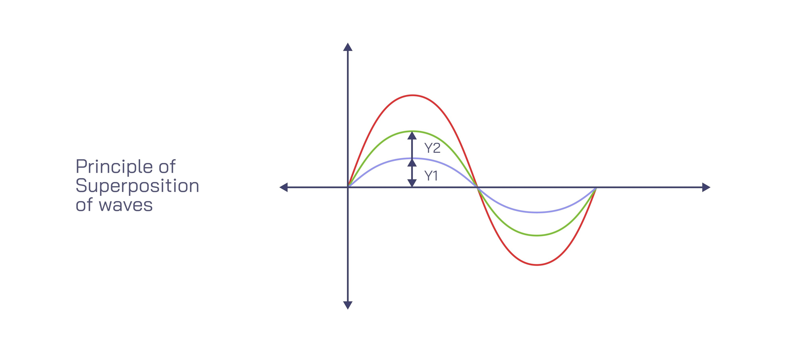

## 3. The Superposition Principle and Standing Waves

When two identical waves travel through the same medium in opposite directions, they interfere with one another. According to the **Superposition Principle**, the resulting wave is simply the algebraic sum of the two individual waves. This specific interaction creates a **standing wave**—a wave that appears to vibrate in place rather than travel horizontally.

### Step 1: The Mathematical Setup
Let's represent our two waves. They have the same amplitude ($A$), wave number ($k$), and angular frequency ($\omega$), but move in opposite directions:
* **Wave 1 (moving right):** $y_1 = A \sin(kx - \omega t)$
* **Wave 2 (moving left):** $y_2 = A \sin(kx + \omega t)$

To find the resulting wave ($y_{res}$), we add them together:
$$y_{res} = y_1 + y_2 = A[\sin(kx - \omega t) + \sin(kx + \omega t)]$$

To simplify this complex expression, we use a standard trigonometric identity for the sum of two sines:
$$\sin(A) + \sin(B) = 2 \sin\left(\frac{A+B}{2}\right) \cos\left(\frac{A-B}{2}\right)$$

---

### Step 2: Deriving the Standing Wave Equation
By applying the trigonometric identity to our wave equations (where $A = kx - \omega t$ and $B = kx + \omega t$), the time ($\omega t$) and space ($kx$) variables separate. 

The resulting equation is:
$$y_{res} = 2A \sin(kx) \cos(\omega t)$$

**What does this mean physically?**
* The spatial part, $2A \sin(kx)$, acts as a new, variable amplitude that depends entirely on the position $x$.
* The temporal part, $\cos(\omega t)$, describes how the string at that specific position oscillates up and down over time $t$. 
* Because $x$ and $t$ are no longer grouped together as $(kx \pm \omega t)$, the wave is not traveling; it is "standing" still and oscillating in place.

---

### Step 3: Calculating the Nodes
In a standing wave, there are specific locations that never move at all. These perfectly still points are called **nodes**. 

Nodes occur wherever the spatial part of our equation equals zero (meaning the amplitude is zero regardless of what the time $t$ is doing):
$$\sin(kx) = 0$$

For the sine function to equal zero, the angle inside ($kx$) must be a multiple of $\pi$ (e.g., $0, \pi, 2\pi, 3\pi \dots$). We express this mathematically using an integer $n$:
$$kx = n\pi \quad \text{for } n = 0, 1, 2, \dots$$

To find the exact physical position ($x$) of these nodes, we isolate $