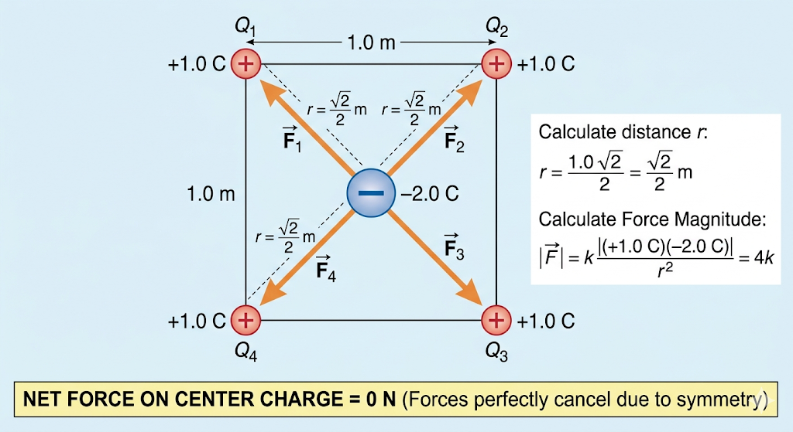

# Coulomb's Law: Center of a Square

## Problem Statement
Four point charges of **+1.0 C** each are placed at the corners of a square with sides of **1.0 m**. Calculate the magnitude and direction of the electric force on a charge of **-2.0 C** placed at the center of the square.

## Conceptual Explanation
By the principle of superposition, the total force on the central charge is the vector sum of the forces from the four corner charges. 
Because the square is highly symmetrical, the distance from each corner to the center is identical. Since all corner charges have the exact same magnitude (+1.0 C), they all pull on the central negative charge (-2.0 C) with the exact same strength.

Every corner has a diagonally opposite corner. The force pulling the central charge top-left is perfectly counteracted by the force pulling it bottom-right. The top-right force is perfectly counteracted by the bottom-left force. These opposite pairs perfectly cancel each other out, leaving a net force of zero.

## Mathematical Proof

**1. Calculate Distance ($r$)**
The diagonal of a square with side $a = 1.0\text{ m}$ is $\sqrt{2}$. The center is exactly halfway, so the distance $r$ from any corner to the center is:
$$r = \frac{\sqrt{2}}{2}\text{ m}$$

**2. Calculate Force Magnitude ($|\vec{F}|$)**
Using Coulomb's Law ($k \approx 8.99 \times 10^9\text{ N}\cdot\text{m}^2/\text{C}^2$):
$$|\vec{F}| = k \frac{|q_{\text{corner}} \cdot q_{\text{center}}|}{r^2}$$
$$|\vec{F}| = k \frac{|(1.0)(-2.0)|}{\left(\frac{\sqrt{2}}{2}\right)^2} = k \frac{2.0}{0.5} = 4k$$

**3. Vector Superposition**
Setting the center at the origin $(0,0)$, the attractive forces point toward the corners at 45°, 135°, 225°, and 315°. Breaking these into x and y components:

* **Sum of X-components:**
$$\sum F_x = 4k \cos(45^\circ) - 4k \cos(45^\circ) - 4k \cos(45^\circ) + 4k \cos(45^\circ) = 0$$

* **Sum of Y-components:**
$$\sum F_y = 4k \sin(45^\circ) + 4k \sin(45^\circ) - 4k \sin(45^\circ) - 4k \sin(45^\circ) = 0$$

**Net Force:** $\mathbf{0\text{ N}}$
