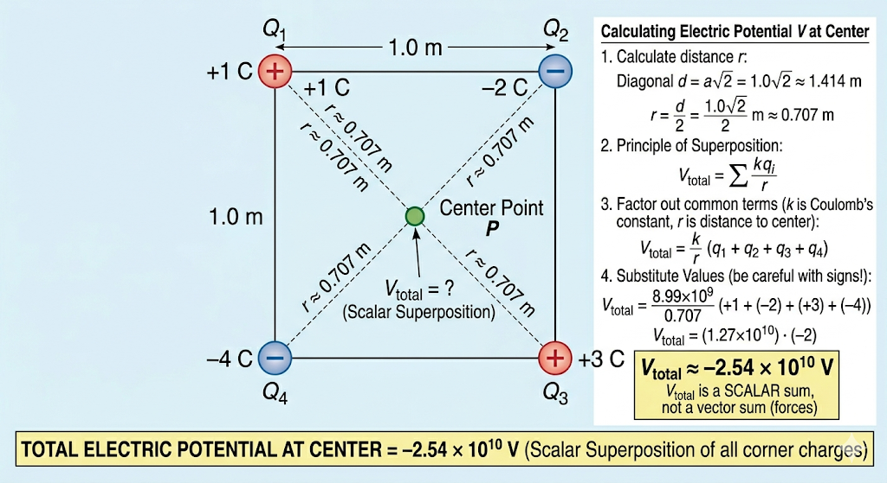

## 2. Electric Potential

**Problem:** Point charges of $+1\text{ C}$, $-2\text{ C}$, $+3\text{ C}$, and $-4\text{ C}$ are placed at the corners of a square with sides of $1.0\text{ m}$ (in order). Calculate the electric potential at the center of the square.

**Solution:**
Unlike electric force, which is a vector, electric potential ($V$) is a scalar quantity. This makes our calculation much simpler, as we do not need to worry about vector angles or cancellations. We simply calculate the potential created by each charge at the center and add them together algebraically (keeping their positive or negative signs).

First, we need to find the distance $r$ from the corners to the center. For a square with side length $a = 1.0\text{ m}$, the length of the full diagonal is given by the Pythagorean theorem as $a\sqrt{2}$. The center is exactly halfway along the diagonal:
$$r = \frac{a\sqrt{2}}{2} = \frac{1.0\text{ m} \cdot \sqrt{2}}{2} \approx 0.707\text{ m}$$

The principle of superposition for electric potential states:
$$V_{\text{total}} = V_1 + V_2 + V_3 + V_4 = \sum \frac{k q_i}{r}$$

Since $k$ (Coulomb's constant, $\approx 8.99 \times 10^9\text{ N}\cdot\text{m}^2/\text{C}^2$) and $r$ are common to all terms, we can factor them out:
$$V_{\text{total}} = \frac{k}{r} (q_1 + q_2 + q_3 + q_4)$$

Plug in the values, being careful to include the negative signs of the charges:
$$V_{\text{total}} = \frac{8.99 \times 10^9}{0.707} (+1 - 2 + 3 - 4)$$
$$V_{\text{total}} = (1.27 \times 10^{10}) \cdot (-2)$$
$$V_{\text{total}} \approx -2.54 \times 10^{10}\text{ V}$$

The total electric potential at the center of the square is approximately $-2.54 \times 10^{10}\text{ Volts}$.

