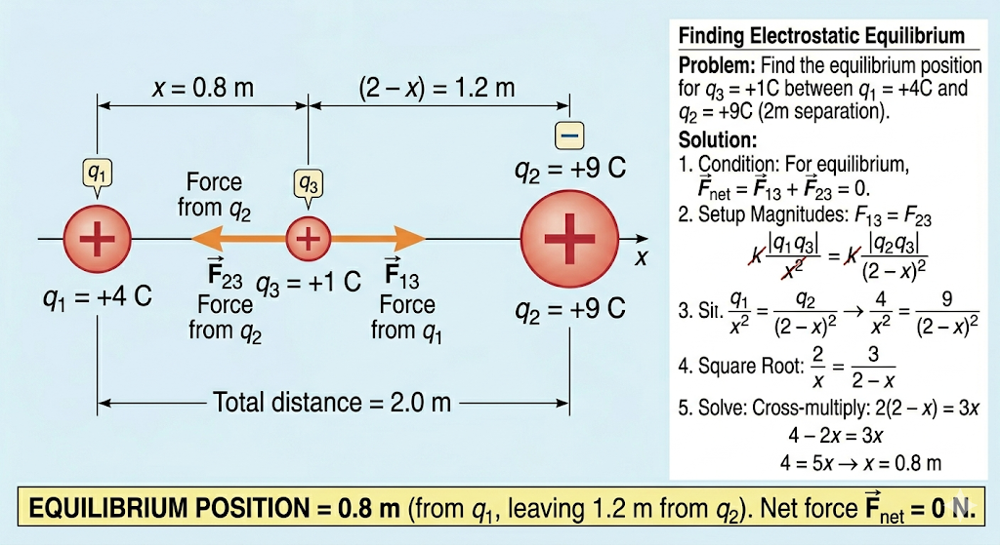

## 3. Electrostatic Equilibrium

**Problem:** Find the equilibrium position for a charge $q_3 = +1\text{ C}$ placed on the line between a charge $q_1 = +4\text{ C}$ and a charge $q_2 = +9\text{C}$, which are separated by a distance of $2\text{ m}$.

**Solution:**
For a particle to be in "electrostatic equilibrium," the net electrostatic force acting on it must be zero. 
Because $q_1$ and $q_2$ are both positive, they will both repel the positive test charge $q_3$. 
* If we place $q_3$ to the left of $q_1$ or the right of $q_2$, both forces would push it in the same direction, so equilibrium is impossible there. 
* Therefore, the equilibrium point must lie *between* the two charges, where the repulsion from $q_1$ pushes right and the repulsion from $q_2$ pushes left.

Let $x$ be the distance from $q_1$ to the equilibrium point. Because the total distance is $2\text{ m}$, the distance from $q_2$ to the equilibrium point will be $(2 - x)$.

For equilibrium, the magnitudes of the two opposing forces must be equal:
$$F_{13} = F_{23}$$
$$k \frac{|q_1 q_3|}{x^2} = k \frac{|q_2 q_3|}{(2-x)^2}$$

Notice that Coulomb's constant $k$ and the magnitude of the test charge $q_3$ appear on both sides. We can divide both sides by $k \cdot q_3$ to simplify the equation immensely:
$$\frac{q_1}{x^2} = \frac{q_2}{(2-x)^2}$$
$$\frac{4}{x^2} = \frac{9}{(2-x)^2}$$

To avoid solving a quadratic equation, we can take the square root of both sides (since physical distances are positive here, we only care about the positive roots):
$$\frac{2}{x} = \frac{3}{2-x}$$

Now, cross-multiply to solve for $x$:
$$2(2 - x) = 3x$$
$$4 - 2x = 3x$$
$$4 = 5x \implies x = \frac{4}{5} = 0.8\text{ m}$$

The equilibrium position is located **$0.8\text{ m}$ away from the $+4\text{ C}$ charge** (and $1.2\text{ m}$ away from the $+9\text{ C}$ charge).

