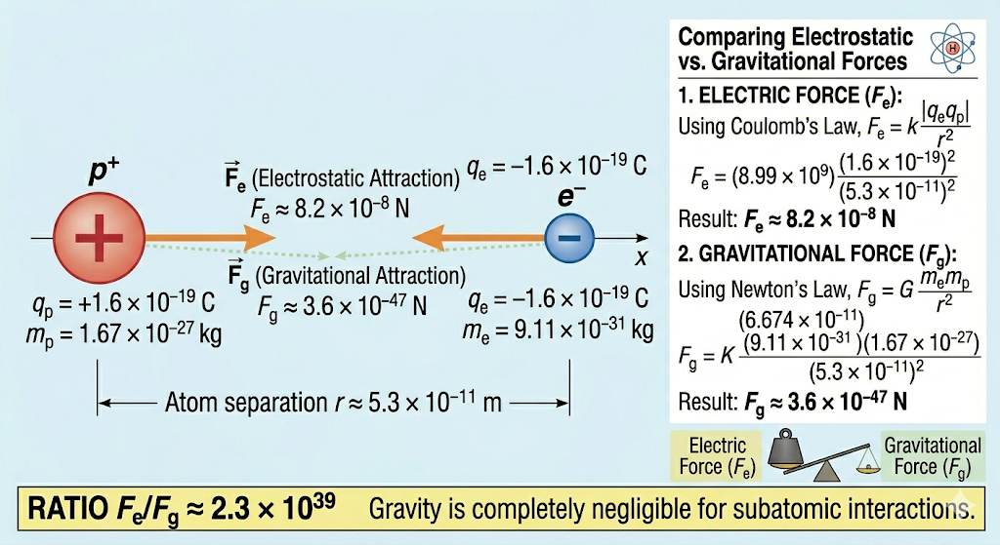

## 4. Force Comparison

**Problem:** Calculate the magnitude of the electric force and gravitational force between an electron and a proton in a hydrogen atom ($r \approx 5.3 \times 10^{-11}\text{ m}$). What is the ratio $F_e/F_g$?

**Solution:**
This problem demonstrates why physicists entirely ignore gravity when studying subatomic particles. We will calculate both forces using their respective inverse-square laws.

**1. Electric Force ($F_e$):**
Using Coulomb's Law, where $e$ is the elementary charge ($1.6 \times 10^{-19}\text{ C}$):
$$F_e = k \frac{|q_e q_p|}{r^2} = k \frac{e^2}{r^2}$$
$$F_e = (8.99 \times 10^9) \frac{(1.6 \times 10^{-19})^2}{(5.3 \times 10^{-11})^2}$$
$$F_e \approx 8.2 \times 10^{-8}\text{ N}$$

**2. Gravitational Force ($F_g$):**
Using Newton's Law of Universal Gravitation, where $G$ is the gravitational constant ($6.674 \times 10^{-11}\text{ N}\cdot\text{m}^2/\text{kg}^2$), $m_e$ is the electron mass, and $m_p$ is the proton mass:
$$F_g = G \frac{m_e m_p}{r^2}$$
$$F_g = (6.674 \times 10^{-11}) \frac{(9.11 \times 10^{-31})(1.67 \times 10^{-27})}{(5.3 \times 10^{-11})^2}$$
$$F_g \approx 3.6 \times 10^{-47}\text{ N}$$

**3. The Ratio:**
To see how many times stronger the electric force is compared to gravity, we divide the two:
$$\frac{F_e}{F_g} = \frac{8.2 \times 10^{-8}}{3.6 \times 10^{-47}} \approx 2.3 \times 10^{39}$$

The electrostatic attraction holding the atom together is roughly $2.3 \times 10^{39}$ times stronger than the gravitational attraction. Gravity is completely negligible at this scale.
