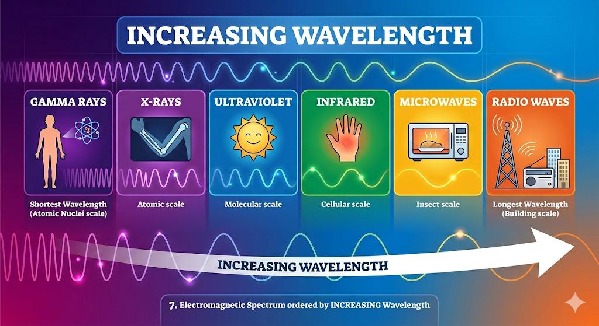

## 8. EM Spectrum

**The Problem:** Order the following by *increasing* wavelength: Infrared, Ultraviolet, Microwaves, X-rays, Radio waves, Gamma rays.

**Answer:**
Shortest wavelengths have the highest energy, while longest wavelengths have the lowest energy. In order of shortest to longest (increasing):
1.  **Gamma rays**
2.  **X-rays**
3.  **Ultraviolet**
4.  **Infrared**
5.  **Microwaves**
6.  **Radio waves**

