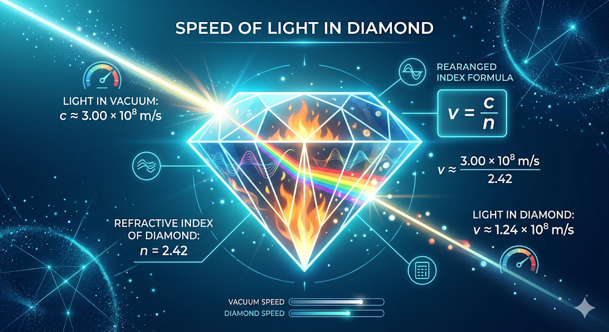

# Physics Calculations: Speed of Light in Media

## Problem Statement
Determine the speed of light in a diamond with an index of refraction $n = 2.42$.

## Formula
The speed of light in a medium is calculated using the formula:

$$v = \frac{c}{n}$$

Where:
* **$v$**: Speed of light in the medium
* **$c$**: Speed of light in a vacuum ($\approx 3.00 \times 10^8 \text{ m/s}$)
* **$n$**: Index of refraction

## Solution
Given:
* $c = 3.00 \times 10^8 \text{ m/s}$
* $n = 2.42$

$$v = \frac{3.00 \times 10^8}{2.42} \approx 1.24 \times 10^8 \text{ m/s}$$

**Result:** Light travels at approximately **1.24 x 10^8 m/s** through a diamond.

