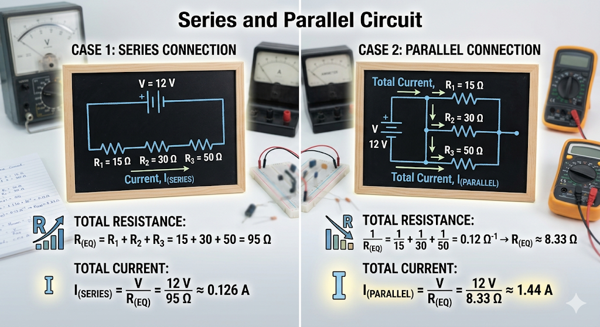

### Step-by-Step Solution

**Given:** * $R_1 = 15\,\Omega$
* $R_2 = 30\,\Omega$
* $R_3 = 50\,\Omega$
* $V = 12\,\text{V}$

---

#### Case 1: Resistors Connected in Series

When resistors are connected in series, the current has only one path to flow through. The total equivalent resistance is simply the sum of all individual resistances. 

**1. Calculate Equivalent Resistance ($R_{eq}$):**
$$R_{eq} = R_1 + R_2 + R_3$$
$$R_{eq} = 15 + 30 + 50$$
$$R_{eq} = 95\,\Omega$$

**2. Calculate Total Current ($I$):**
Using Ohm's Law ($V = I \cdot R$), we can find the total current flowing from the battery:
$$I_{series} = \frac{V}{R_{eq}}$$
$$I_{series} = \frac{12}{95}$$
$$I_{series} \approx 0.126\,\text{A}$$

---

#### Case 2: Resistors Connected in Parallel

When resistors are connected in parallel, the voltage across each resistor is the same, but the current splits across multiple paths. The reciprocal of the total equivalent resistance is the sum of the reciprocals of each individual resistance.

**1. Calculate Equivalent Resistance ($R_{eq}$):**
$$\frac{1}{R_{eq}} = \frac{1}{R_1} + \frac{1}{R_2} + \frac{1}{R_3}$$
$$\frac{1}{R_{eq}} = \frac{1}{15} + \frac{1}{30} + \frac{1}{50}$$

To add these fractions, find a common denominator (which is 150):
$$\frac{1}{R_{eq}} = \frac{10}{150} + \frac{5}{150} + \frac{3}{150}$$
$$\frac{1}{R_{eq}} = \frac{18}{150} = 0.12\,\Omega^{-1}$$

Now, take the reciprocal to find $R_{eq}$:
$$R_{eq} = \frac{150}{18} = \frac{25}{3}$$
$$R_{eq} \approx 8.33\,\Omega$$

**2. Calculate Total Current ($I$):**
Using Ohm's Law again with the parallel equivalent resistance:
$$I_{parallel} = \frac{V}{R_{eq}}$$
$$I_{parallel} = \frac{12}{\frac{25}{3}}$$
$$I_{parallel} = \frac{12 \cdot 3}{25}$$
$$I_{parallel} = \frac{36}{25}$$
$$I_{parallel} = 1.44\,\text{A}$$

