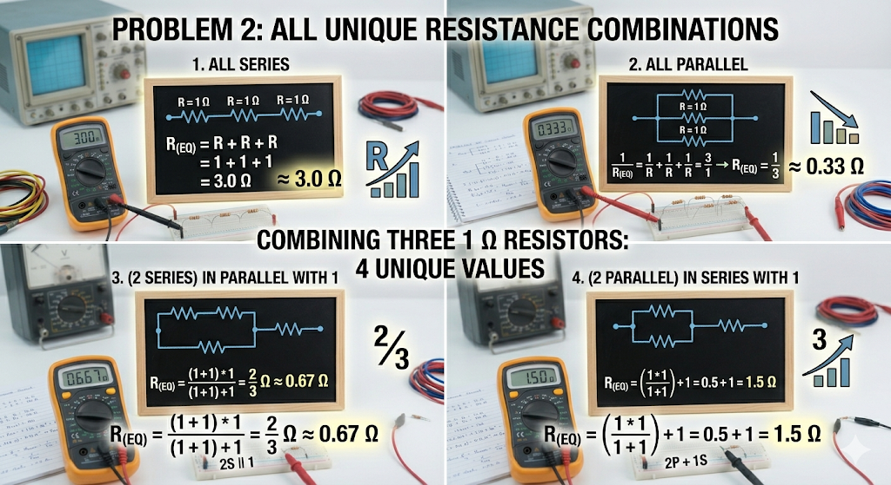

### Problem 2: Combinations of Three Resistors

Given three resistors where $R = 1\,\Omega$, we can create four unique equivalent resistances ($R_{eq}$) by exploring all series, parallel, and hybrid configurations.

#### 1. All Series
In a purely series circuit, the total resistance is the sum of the individual resistors:
$$R_{eq} = R_1 + R_2 + R_3$$
$$R_{eq} = 1 + 1 + 1 = 3\,\Omega$$

#### 2. All Parallel
In a purely parallel circuit, the reciprocal of the total resistance is the sum of the reciprocals:
$$\frac{1}{R_{eq}} = \frac{1}{R_1} + \frac{1}{R_2} + \frac{1}{R_3}$$
$$\frac{1}{R_{eq}} = \frac{1}{1} + \frac{1}{1} + \frac{1}{1} = 3\,\Omega^{-1}$$
$$R_{eq} = \frac{1}{3} \approx 0.33\,\Omega$$

#### 3. Hybrid A: Two in Series, Parallel with One
First, calculate the series branch:
$$R_{branch} = 1 + 1 = 2\,\Omega$$
Next, calculate this branch in parallel with the third resistor:
$$R_{eq} = \frac{R_{branch} \cdot R_3}{R_{branch} + R_3}$$
$$R_{eq} = \frac{2 \cdot 1}{2 + 1} = \frac{2}{3} \approx 0.67\,\Omega$$

#### 4. Hybrid B: Two in Parallel, Series with One
First, calculate the parallel pair:
$$R_{pair} = \frac{1 \cdot 1}{1 + 1} = 0.5\,\Omega$$
Next, calculate this pair in series with the third resistor:
$$R_{eq} = R_{pair} + R_3$$
$$R_{eq} = 0.5 + 1 = 1.5\,\Omega$$

---

### Final Unique Values
By combining exactly three $1\,\Omega$ resistors, the four possible unique equivalent resistances are:
$$3.0\,\Omega, \quad 1.5\,\Omega, \quad 0.67\,\Omega, \quad 0.33\,\Omega$$

