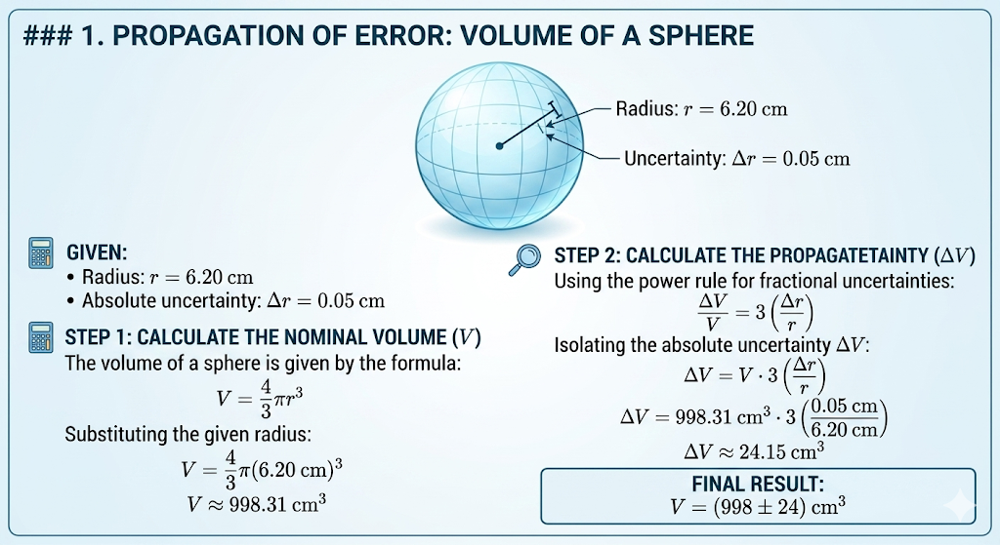

* Radius: $r$ = 6.20 cm
* Absolute uncertainty: $\Delta r$ = 0.05 cm

**Step 1: Calculate the Nominal Volume ($V$)**
The volume of a sphere is given by the formula:

$$V = \frac{4}{3}\pi r^3$$

Substituting the given radius:

$$V = \frac{4}{3}\pi (6.20\text{ cm})^3$$

$$V \approx 998.31\text{ cm}^3$$

**Step 2: Calculate the Propagated Uncertainty ($\Delta V$)**
Using the power rule for fractional uncertainties:

$$\frac{\Delta V}{V} = 3 \left( \frac{\Delta r}{r} \right)$$

Isolating the absolute uncertainty $\Delta V$:

$$\Delta V = V \cdot 3 \left( \frac{\Delta r}{r} \right)$$

$$\Delta V = 998.31\text{ cm}^3 \cdot 3 \left( \frac{0.05\text{ cm}}{6.20\text{ cm}} \right)$$

$$\Delta V \approx 24.15\text{ cm}^3$$

**Final Result:**

$$V = (998 \pm 24)\text{ cm}^3$$

