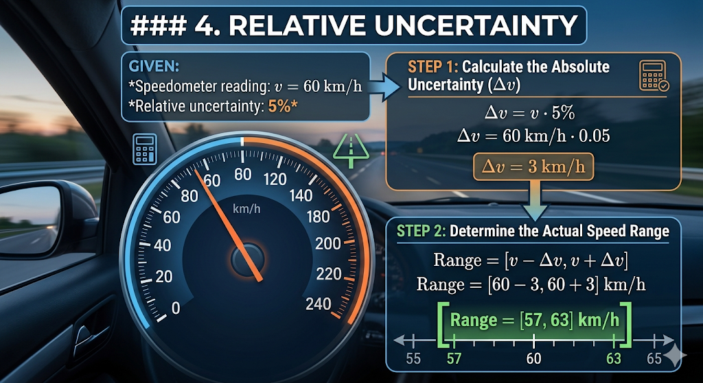

### 4. Relative Uncertainty

**Given:**

* Speedometer reading: $v$ = 60 km/h
* Relative uncertainty: **5%**

**Step 1: Calculate the Absolute Uncertainty ($\Delta v$)**

$$\Delta v = v \cdot 5\%$$

$$\Delta v = 60\text{ km/h} \cdot 0.05$$

$$\Delta v = 3\text{ km/h}$$

**Step 2: Determine the Actual Speed Range**

$$\text{Range} = [v - \Delta v, v + \Delta v]$$

$$\text{Range} = [60 - 3, 60 + 3]\text{ km/h}$$

$$\text{Range} = [57, 63]\text{ km/h}$$

